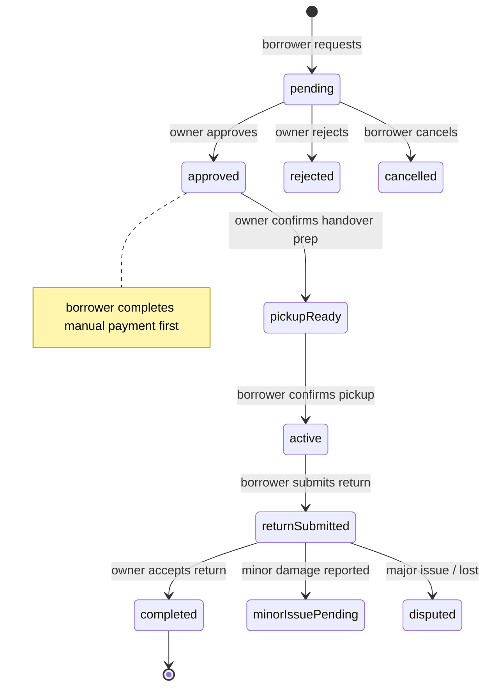

# Jirani — Architecture

## Data layer convention

| Layer | Location | Responsibility |
|-------|----------|----------------|
| **Repository** | `lib/shared/data/repositories/` | Firestore/Storage I/O for a single domain entity |
| **Service** | `lib/shared/services/` | Multi-step workflows, cross-entity orchestration |
| **Provider / ViewModel** | `lib/resident/providers/`, `lib/shared/logic/` | UI state; depends on repositories/services |
| **View** | `lib/resident/screens/`, `lib/admin/screens/` | Rendering; no direct Firebase calls |

UI must not import services directly except through providers/view models.

Some repositories delegate to services (e.g. `ChatRepository` → `ChatService`).

---

## Firestore collections

| Collection | Purpose |
|------------|---------|
| `users` | Private resident/admin profile (owner read/write) |
| `publicProfiles` | Neighbor-visible profile fields (synced by CF) |
| `admins` | Admin accounts |
| `communities` | Partner communities |
| `verificationRequests` | Residency document submissions + OCR status |
| `items` | Marketplace listings |
| `borrowRequests` | Item borrow lifecycle + review flags |
| `reviews` | Blind marketplace feedback |
| `services` / `serviceRequests` | Neighbor services catalog |
| `connections` | Resident neighbor connections |
| `chats` / `messages` | Direct messaging |
| `notifications` | In-app notification feed |
| `communityPosts` | Admin community announcements |
| `reports` | Disputes and misconduct reports |
| `transactions` | Payment placeholders (manual_v1) |
| `activityLogs` | Admin audit trail |

Storage paths: `item_images/`, `verification_documents/`, `borrow_request_proofs/`, `chat_attachments/`, `profile_images/`.

---

## Auth routing

`AuthWrapper` (`lib/shared/logic/auth_wrapper.dart`) decides the initial screen:

```
Firebase session?
  No  → Web: AdminLogin | Mobile: ResidentPreAuthGate (onboarding/login)
  Yes → Load profile
          → Registration email/phone verification steps (if flagged)
          → role resident → ResidentGeofenceGate → ResidentMainShell
          → role admin    → AdminDashboardScreen
```

Geofence gate ensures the resident is physically within their registered community before full app access.

---

## Borrow request state machine

Primary happy path:



Rules enforcing transitions live in `firestore_rules/04_borrow.functions.rules`. Client logic is in `lib/shared/services/borrow_request_service.dart` (split into lifecycle, handover, return, disputes parts).

On `completed`, Cloud Functions update trust/completion counters (`functions/src/borrow_completion.ts`, `trust_score.ts`).

---

## Blind review flow

1. Borrow reaches `completed`.
2. Each party submits one review via `ReviewService.createReview` — stored with `visible: false`, `status: hidden`, and `publishAfter` (+3 days from completion).
3. Borrow request flags: `borrowerReviewSubmitted`, `ownerReviewSubmitted`, `reviewGraceEndsAt`.
4. `functions/src/review_publish.ts` publishes both reviews when grace ends **or** both have submitted.
5. Published reviews are anonymous in the UI; trust score updates run server-side.

Rules: `firestore_rules/09_review.functions.rules`, `13_collections_reviews_reports.rules`.  
Tests: `test/firestore/review_publish_rules.test.mjs`, `test/services/review_service_test.dart`.

---

## Residency verification

1. Resident uploads document (utility bill, tenancy, access card) → `verificationRequests`.
2. OCR Cloud Function extracts fields (`functions/src/ocr/`).
3. Admin reviews in dashboard → updates `verificationStatus` on `users` (via CF sync, not client-direct).
4. Verified residents can list marketplace items and borrow.

Storage reads for verification documents are restricted to the owner and admins (`storage.rules`).

---

## Security model

| Concern | Enforced by |
|---------|-------------|
| Who can read private user data | Firestore rules on `users` |
| Neighbor profile visibility | `publicProfiles` + rules; CF sync from `users` |
| Trust / reputation writes | Cloud Functions only |
| Borrow status transitions | Firestore rules + client service guards |
| Review publish / visibility | Firestore rules + `review_publish` CF |
| Item listing ownership | Rules + verified-resident check in `ItemRepository` |
| App Check | Release: Play Integrity / Device Check; debug builds only in `kDebugMode` |

**UI checks are UX only** — always assume a modified client. Rules and Cloud Functions are the authority.

---

## Modular Firestore rules

Edit fragments under `firestore_rules/*.rules`, then rebuild:

```bash
npm run build:firestore-rules
```

Deploy output: root `firestore.rules`. Module index: `firestore_rules/00_index.rules`.

---

## Cloud Functions

| Function area | File |
|---------------|------|
| Trust score | `trust_score.ts` |
| Public profile sync | `public_profile.ts` |
| Review publish | `review_publish.ts` |
| Verification status sync | `verification_sync.ts` |
| Borrow completion counters | `borrow_completion.ts` |
| Push / in-app notifications | `notifications.ts`, `*_notifications.ts` |
| OCR extraction | `ocr/extractFields.ts` |

Build: `cd functions && npm run build`. Deploy with Firebase CLI.
